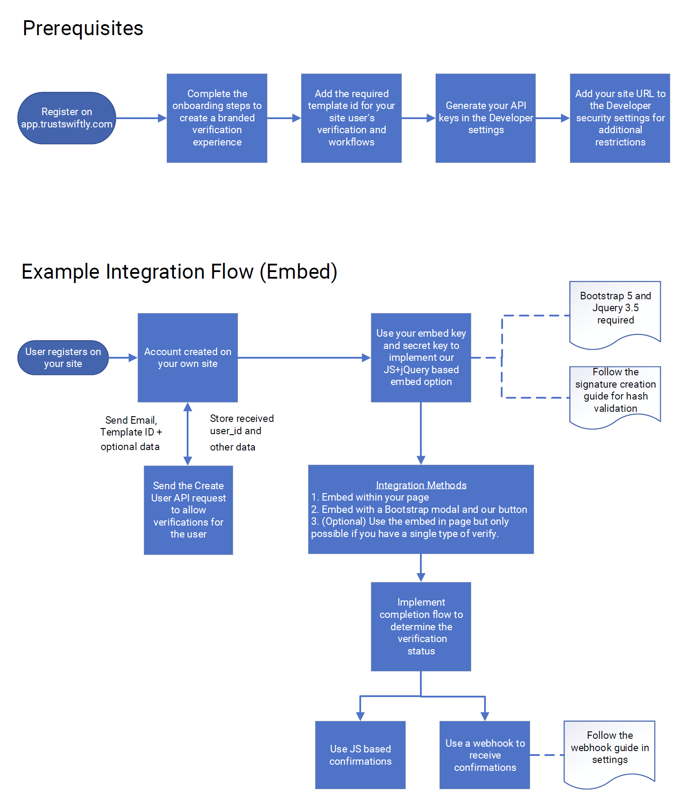

# HTML + Javascript

## General

This document explains how to integrate the verification flow directly into your web application through our JavaScript component to **verify** the identity of your users. This stage might be at the **signup** page of your application, or at a later point to enrich the profiles of your users. An example page of the HTML integration can be found at [https://{sub-domain}.trustswiftly.com/account/test.html](https://{sub-domain}.trustswiftly.com/account/test.html)




## 1. Importing the component

Start your integration by importing the Trust Swiftly embed JavaScript to your HTML page.

```markup
<script type="text/javascript" src="https://cdn.trustswiftly.com/account/trust-verify.min.js"></script>
```

## 2. Initializing the component

| Argument | Description |
| :--- | :--- |
| **clientToken** | The token used to identify a given user. |
| **baseUrl** | The URL used for your hosted panel. |

```markup
<button type="button" id="myButton"></button>
```

```markup
<script>
    const handler = TrustVerify.configure({
        onComplete: function() {},
        onExit: function() {},
        onDisplay: function() {},
        onStateChange: function() {},
        onError: function() {}
    });
    document.getElementById('myButton').addEventListener('click', function(e) {
        handler.open({
            clientToken: 'YOUR_TOKEN',
            baseUrl: 'YOUR_SITE_URL'
        });
    });
</script>
```

## 3. Setup a Button Click Listener

```javascript
document.getElementById('myButton').addEventListener('click', function(e) {
        handler.open({
            clientToken: 'YOUR_TOKEN',
            baseUrl: 'YOUR_SITE_URL'
            modal: true
        });
    });
```

### Client Callbacks

| Parameter | Description |
| :--- | :--- |
| onDisplay | The onDisplay callback is called when the individual has clicked on the first "Start verifying" button and dialog is shown. |
| onStateChange | This callback is called when a user processes the verification and verification status is changed to either “pending” or “complete” or “failed” |
| onError | This callback is called when there’s an error encountered during a verify. |
| onComplete | This Callback is called when any verification is completed |
| onExit | This callback is called when user closes the embedded flow dialog. |

