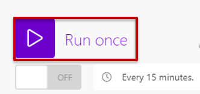
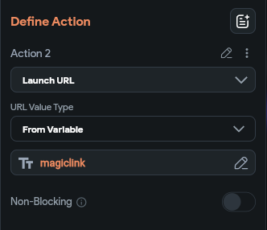
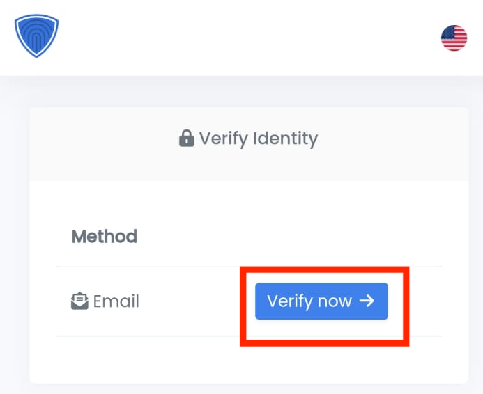
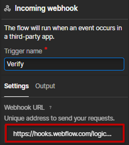

# FlutterFlow Identity Verification

### Overview 

Trust Swiftly provides powerful identity verification tools designed to help fast-moving businesses ensure secure and seamless customer onboarding. This guide demonstrates how to integrate Trust Swiftly's verification services into a [FlutterFlow ](https://flutterflow.io/)app. The example app allows users to register, complete ID verification, and view their verification status—all within the FlutterFlow platform. By following this guide, you'll learn how to create a user for verification, implement the verification process, and handle the verification status using Trust Swiftly’s API and webhooks.


The following guide is for reference purposes only to integrate with FlutterFlow. For production and advanced usage, you may be required to customize the setup.&#x20;


### Prerequisites 

* A [FlutterFlow account](https://app.flutterflow.io/create-account) with a basic understanding of how to create and manage FlutterFlow apps.
* API access to Trust Swiftly. Ensure you have your [API key ready](../getting-an-api-key.md).
* Familiarity with webhooks and FlutterFlow’s API workflows.

### Steps to Implement 

#### Set Up API Key in FlutterFlow 

Before you start making API calls to Trust Swiftly, you need to configure your API key in FlutterFlow.

* In your FlutterFlow app, navigate to the "API Calls" tab
* Click on the + Add API Call button to start creating a new API integration.

#### Create a User for Verification 

To verify a user through Trust Swiftly, you'll first need to create the user via their API. This user will undergo the ID verification process.

1. **Name the API Call**:
   * Give your API call a name, like “CreateUser”
2. **Set the API Details**:
   * **API Method**: Choose POST.
   * **API URL**: Enter the Trust Swiftly API endpoint URL where the user will be created.
3. **Add Headers**:
   * In the "Headers" section, click "Add header" and include the following:
     * **Authorization**:
       * **Key**: Authorization
       * **Value**: Bearer YOUR\_API\_KEY (replace YOUR\_API\_KEY with the actual API key provided by Trust Swiftly)
     * **Content-Type**:
       * **Key**: Content-Type
       * **Value**: application/json

<figure><figcaption></figcaption></figure>

**Create Variables:**

* Go to the Variables section in Define API Call
* Click Add Variable and define your variables (e.g., email) Choose the appropriate type based on what the variable will hold (e.g., String).

<figure><figcaption></figcaption></figure>

1. **Set the Request Body**:

* Go to the Body section in Define API Call
  * **Body Type**: Select "JSON."
  * **JSON Body**: Enter the JSON body structure, drag and drop variables for dynamic values that will be filled in from your app’s data.

<figure><figcaption></figcaption></figure>

**6. Testing Your API Call**

1. **Set Variable Values:**
   * Go to the **Response and Test** tab in the API configuration.
   * Enter sample values for your variables to test the API call.
2. **Run the Test:**
   * Click “**Test API Call”** to execute the API call with the provided variable values.
   * Check the response to ensure that the API call is functioning as expected.

<figure><figcaption></figcaption></figure>

**7. Using API Responses**

1. **Handle API Responses:**
   * After Testing API call go to “Response Type” section which is just below “Preview and Test” section.
   * Click on “Add JSON path” of the JSON Path named “$.magic\_link”.
   * Give JSON Path a name, like “magicLink”

<figure><figcaption></figcaption></figure>

1. **Initialize the API Call**:
   * After configuring all necessary parameters, request body, and endpoint details, click the “Add Call” button.
   * This action will save the API call configuration in your FlutterFlow project.

#### Setting Up Register Button Action

**1. Setting Up the API Action**

1. **Navigate to the Register Button:**
   * Locate the page containing the register button that will trigger the API call.
2. **Configure Button Click Action:**
   * Select the register button widget on your page.
   * In the widget properties panel, locate the **Actions** section.

<figure><figcaption></figcaption></figure>

1. **Add API Call Action:**
   * Open Action Flow Editor
   * Click on **Add Action** to create a new action.
   * Choose **API Call** from the list of action types.
   * Drop down “Group or Call Name” and select your API i.e “createuser”.

<figure><figcaption></figcaption></figure>

1. **Map Button Inputs to API Call Parameters:**
   * “**Create User API**” requires parameters such as email, map these inputs to the corresponding fields in the API call configuration.
   * Click on “Set Additional Variable” and drop-down Variable name and select the variables needed by your API.
   * Click on dynamic value button (represented by orange icon)
   * Drop down “Widget State” and select the field corresponding to your variable.
   * Name “Action Output Variable Name” as APIResponse. Magic link will be stored in this variable

**2. Navigating to the Verification Page**

1. **Add Navigation Action:**
   * After configuring the API call, click **Add Action** again to create a new action.
   * Select **Navigate to Page** from the list of action types.
   * Choose the verification page you want to navigate to upon successful registration.
2. **Pass Parameters to Verification Page:**
   * Go to Verification Page and Click **Edit Parameters Icon.**
   * Click on “Add Parameters” and name your parameter as “email” and “magiclink” and define the type as string.

**3. Configuring Parameters**

1. **Click on “Pass” to Add New Parameters:**
   * Go to back to your **Action Flow Editor** in the signup page where your register button is located
   * In the navigation action settings, configure the parameters to be passed to the verification page.
   * Click on “Pass” to add new Parameters
   * Enter the required parameters, such as email and magic link, and assign dynamic values.

Example:

* **Parameter Name:** email
  * **Value Source:** Bind to the email input field or the result from the API call.

1. **Configuring the Magic Link Parameter**
   * For Magic link, drop-down “**Action Outputs**” and select “APIResponse”

<figure><figcaption></figcaption></figure>

* Provide the JSON path to extract the magic link from the API response.
* In **API Response Options**, drop-down and select “JSON Body”.
* In **Available Options,** select “JSON Path”.
* Provide the **JSON path** to extract the magic link from the API response. For example, if the API response contains the magic link at $.magic\_link, specify this path.
* After configuring the parameters and selecting the appropriate action outputs, click **“Confirm”** to save your changes.

By following these steps, you can configure an action to invoke an API call when a register button is clicked, and ensure that the application navigates to a verification page while passing essential parameters such as email and magic link. This setup streamlines the registration and verification process, enhancing user experience and interaction within your app.

#### Handle Verification Button and Email Magic Link

After successfully creating the user, the next step is to enable the user to initiate the ID verification process. When the user clicks the "Verify" button, they should receive a magic link via email, which they will use to complete the verification.

1. **Handle Redirection to Magic Link**:
   * When the user clicks the "Verify" button, you'll need to trigger an action that redirects the user to magic link.
   * Add an action “Launch URL” and set the URL Value Type to “From Variable”.
   * Drop-down page parameter and select “magiclink”.

This will redirect the user to magic link when the verify button is clicked

 

**Set Up Email Notifications for Verification**

1. **Access Trust Swiftly Users Page:**
   * Log in to your Trust Swiftly account and navigate to the “Users” page.
2. **Find the User:**
   * Locate the user you want to verify by searching for their details (e.g., email or user ID).
3. **Click Verification Button:**
   * Select the user and click on the “Verification” button to access the verification settings.

1. **Enable Email Notifications:**
   * In the verification settings, ensure that email notifications are enabled.
   * This setting allows Trust Swiftly to send the necessary verification emails to the user, including the magic link and any follow-up emails if additional verification is needed.

**Receive and Access the Magic Link**

1. **Initial Email with Magic Link:**
   * The user receives an email with a magic link from Trust Swiftly.
   * Clicking this link directs the user to a verification page with a "Verify" button.

**Click the Magic Link and Verify Identity**

1. **Verification Page:**
   * On the verification page, the user clicks the "Verify" button to start the verification process.

1. **Initial Verification Attempt:**
   * Trust Swiftly processes the verification request. If additional verification is required, the user will receive a follow-up email.

**Follow-Up Email**

1. **Receive Follow-Up Email:**
   * If further verification is necessary, Trust Swiftly sends a follow-up email.
   * Example Content:
     * “Due to an additional review we require another method of verification. Please complete the new request to verify yourself.”
     * Verify Identity Button: Includes a button or URL for completing the additional verification.

*
  * Click on Confirm Email button and it will redirect you another page
  * Enter your email in the field and click the “Send verification Email” button

#### Set Up Webhook for Verification Status 

To keep track of the verification status, you need to set up a webhook with Trust Swiftly and configure FlutterFlow to handle the incoming webhook data. This will allow you to update the user’s verification status based on Trust Swiftly's notifications.

**1. Create a Webhook in Trust Swiftly**

1. **Log in** to your Trust Swiftly account and navigate to the Webhooks section in the dashboard under “Developers” tab.
2. **Create a New Webhook**:
   * Click on “Create Webhook” to start the setup process.

* **Webhook URL**: Enter the URL where Trust Swiftly will send the webhook notifications. This should be the endpoint of your FlutterFlow app that will handle incoming webhooks.
* **Verifications:** Select “Email”
* **Webhook Events**: Verification.completed
* **Save**: Complete the setup by saving the webhook configuration.

**2. Configure Workflow in FlutterFlow**

1. **Create new API Call**:

* In your FlutterFlow app, go to the "API Calls" section.
* Create a new API call. This will serve as the endpoint for handling webhook requests.
* Give your API call a name, like “verifyuser”.

1. **Set Up the Webhook Endpoint**:
   * **Endpoint Name**: Choose a meaningful name (e.g., handle\_verification\_webhook).
   * **Endpoint URL**: Generate a URL for this API. Copy this URL and use it as the Webhook URL in Trust Swiftly. The webhook URL format looks like

**https://\<your-website>/\<your-webhook-endpoint>**

**For example,**

[https://app.flutterflow.io/project/demo-4d8110/verifyuser](https://app.flutterflow.io/project/demo-4d8110/verifyuser)

where “demo” is the name of the app, “4d8110” is the id of your project and “verifyuser” is the name of API.

1. **Set the API Details**:
   * **API Method**: Choose POST.
   * **API URL**: Enter the API end pint URL.
2. **Add Headers**:
   * In the "Headers" section, click "Add header" and include the following:
     * **Content-Type**:
       * **Key**: Content-Type
       * **Value**: application/json

By following these steps, you’ll be able to set up and handle webhooks from Trust Swiftly, ensuring your FlutterFlow app stays in sync with the latest verification status updates.

#### Redirect Users to Success Page Upon Verification 

Once the user completes the verification process, you need to ensure they are redirected to a success page to confirm their verification status.

**1. Handle Verification Completion in FlutterFlow**

1. **Set Up Redirection Logic**:
   * **Trigger Redirection**:

* Go to your “Verification Page” and add action “Backend Call API”.
* Select “verifyuser” **as Group or Call Name**.
* **Name Action Variable Name** as “APIResult”.
* In conditional Action, under the **“True”** field in the Conditional Action, click on **Add**.
* Add new Action “Navigate to” and select “Verification Successful Page”

**Example Success Page**

By setting up the redirection to a success page, you provide users with a clear confirmation of their verification status, enhancing the overall user experience.
